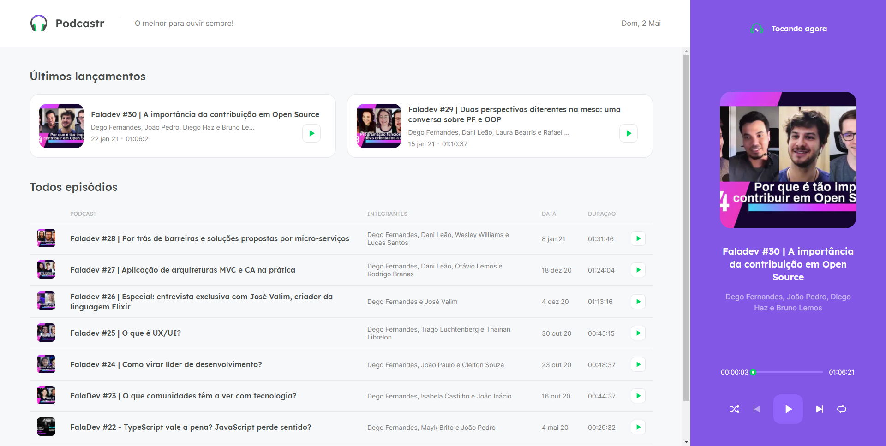

<h1 align="center">
    
</h1>
<h2 align="center">Next Level Week #5</h2>
<h1 align="center">
    
</h1>

## 💻 Tecnologias

O projeto foi desenvolvido usando as tenologias:
- [Next.js](https://nextjs.org/)
- [React](https://reactjs.org)
- [TypeScript](https://www.typescriptlang.org/)

## 🎧 Podcastr

<h3 align="center">
<a href="https://podcastr-orpin-xi.vercel.app/">Podcastr</a>
</h3>

Podcastr é uma plataforma de streaming do Podcast **[FalaDev](https://open.spotify.com/show/3TNsKUGlP9YbV1pgy3ACrW)**
Apresentado pela **[Rocketseat]((https://github.com/Rocketseat))**

O projeto foi desenvolvido durante a quinta edição do [Next Level Week](https://nextlevelweek.com/), pela **[Rocketseat]((https://github.com/Rocketseat))** em Abril de 2021.

## 🚀 Iniciando o Projeto

Clone o projeto e acesse a pasta de desenvolvimento

```bash
$ git clone https://github.com/frazaao/Podcastr.git && cd podcastr
```

Inicie o projeto com os comando abaixo no console
```bash
# Instalando dependencias do projeto
$ yarn

# Rodar o JSON server
$ yarn server

# Iniciar o projeto
$ yarn dev
```

## 🔖 Layout

Você pode acessar o Layout do projeto através do link abaixo:

- [Layout Web](https://www.figma.com/file/UwFEntsHpHYJlHNQAQr4gA/Podcastr?node-id=160%3A2761) 

Lembre-se que você precisa ter uma conta [Figma](http://figma.com/) para acessar.

<h3>
    Feito com ❤️ por <a href="https://www.linkedin.com/in/matheus-paula-frazao-5b7284202/">Matheus Paula Frazão</a>
</h3>
